# Class Activity 1 — System Calls in Practice

- **Student Name:** Dara Panhaseth
- **Student ID:** p20250002
- **Date:** March 31, 2026

---

## Warm-Up: Hello System Call

Screenshot of running `hello_syscall` on Linux:

Screenshot of running `copyfilesyscall` on Linux:

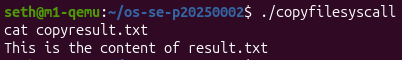

**Warm-up source files are located in `warmup/` folder.**

---

## Task 1: File Creator & Reader

### Part A — File Creator

**Implementation Notes:**
- Version A uses `fopen()`, `fprintf()`, `fclose()` (C library functions)
- Version B uses `open()`, `write()`, `close()` (POSIX system calls)

**Version A — Library Functions (`file_creator_lib.c`):**

**Version B — POSIX System Calls (`file_creator_sys.c`):**

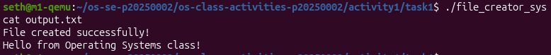

**Questions:**

1. **What flags did you pass to `open()`? What does each flag mean?**

   I used: `O_WRONLY | O_CREAT | O_TRUNC`
   - `O_WRONLY` = open for writing only
   - `O_CREAT` = create the file if it doesn't exist
   - `O_TRUNC` = truncate (erase) the file if it already exists

2. **What is `0644`? What does each digit represent?**

   `0644` is the permission mode in octal:
   - `6` (owner) = read + write
   - `4` (group) = read only
   - `4` (others) = read only

3. **What does `fopen("output.txt", "w")` do internally that you had to do manually?**

   `fopen("w")` internally calls `open()` with `O_WRONLY | O_CREAT | O_TRUNC` to open/create the file, and also sets up a buffer for buffered I/O. I had to do both steps manually.

### Part B — File Reader & Display

**Implementation Notes:**
- Version A uses `fopen()`, `fgets()`, `printf()`
- Version B uses `open()`, `read()`, `write()`

**Version A — Library Functions (`file_reader_lib.c`):**

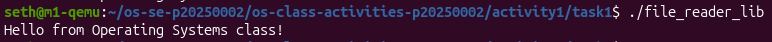

**Version B — POSIX System Calls (`file_reader_sys.c`):**

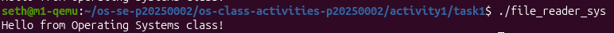

**Questions:**

1. **What does `read()` return? How is this different from `fgets()`?**

   `read()` returns the number of bytes actually read, or `0` at end of file, or `-1` on error. `fgets()` returns a pointer to the string or `NULL` on EOF/error. `read()` gives raw byte counts while `fgets()` reads up to a newline.

2. **Why do you need a loop when using `read()`? When does it stop?**

   A loop is needed because `read()` may not read all bytes in one call. It stops when `read()` returns `0`, indicating end of file.

---

## Task 2: Directory Listing & File Info

**Implementation Notes:**
- Both versions use `opendir()`, `readdir()`, `stat()`
- Version A uses `printf()` for output
- Version B uses `snprintf()` + `write()` for output

**Version A — Library Functions (`dir_list_lib.c`):**

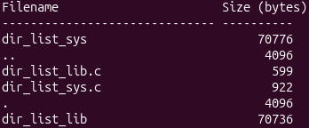

**Version B — System Calls (`dir_list_sys.c`):**

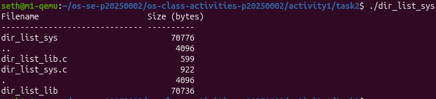

**Questions:**

1. **What struct does `readdir()` return? What fields does it contain?**

   `readdir()` returns a pointer to `struct dirent` containing:
   - `d_name` = filename
   - `d_ino` = inode number
   - `d_type` = file type

2. **What information does `stat()` provide beyond file size?**

   `stat()` provides: file size, permissions, owner, group, timestamps (access, modify, change), number of links, device IDs, and more.

3. **Why can't you `write()` a number directly — why do you need `snprintf()` first?**

   `write()` expects a pointer to a buffer of bytes. Numbers need to be converted to ASCII text before writing to the terminal. `snprintf()` does this conversion.

---

## Task 3: strace Analysis

**Observations:**
The library version made significantly more system calls than the system call version due to buffering, library initialization, and dynamic linking overhead.

### strace Output — Library Version (File Creator)

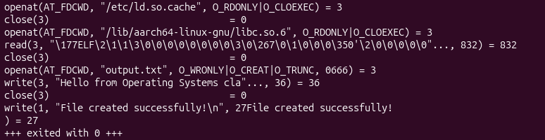

### strace Output — System Call Version (File Creator)

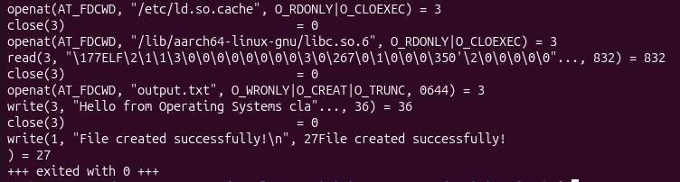

### strace -c Summary Comparison

**Library Version:**
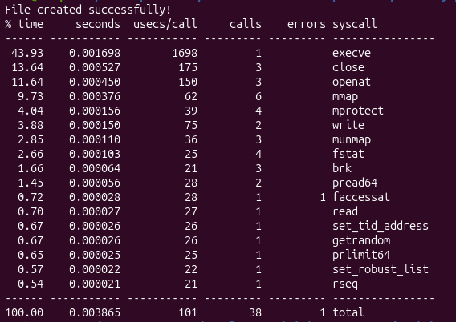

**System Call Version:**
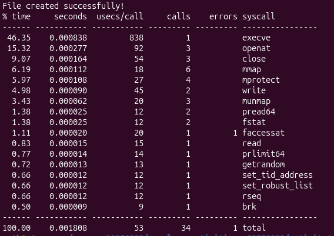

### Questions

1. **How many system calls does the library version make compared to the system call version?**

   [Your answer — check `strace -c` output]

2. **What extra system calls appear in the library version? What do they do?**

   Extra calls include: `brk()` (memory allocation), `mmap()` (mapping libraries), `fstat()` (file info), `access()` (check file permissions). These are for library initialization and buffering.

3. **How many `write()` calls does `fprintf()` actually produce?**

   `fprintf()` buffers output. Only one `write()` call occurs when the buffer is full or when `fflush()` is called (e.g., when program exits).

4. **In your own words, what is the real difference between a library function and a system call?**

   A system call is a direct request to the kernel (e.g., `write()`, `open()`). A library function is a higher-level wrapper that may or may not use system calls. Library functions provide convenience features like buffering and formatting.

---

## Task 4: Exploring OS Structure

### System Information

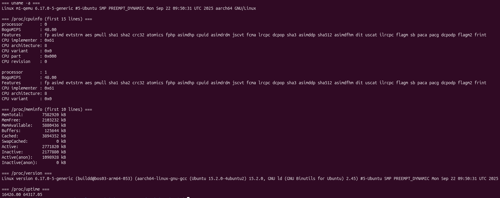

### Process Information

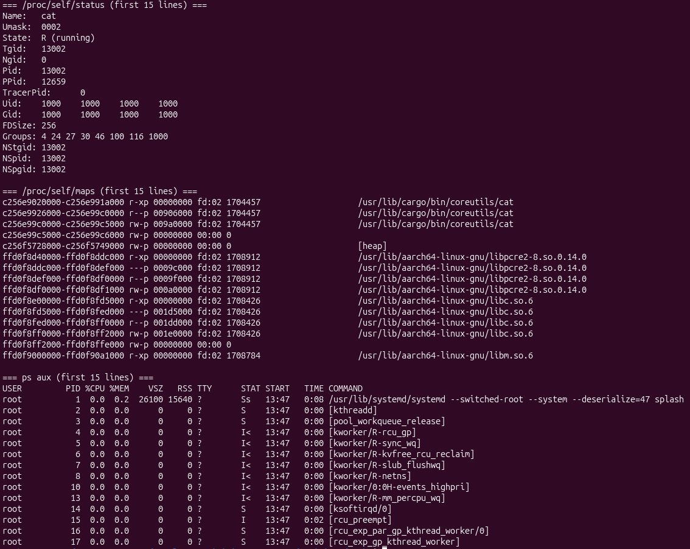

### Kernel Modules

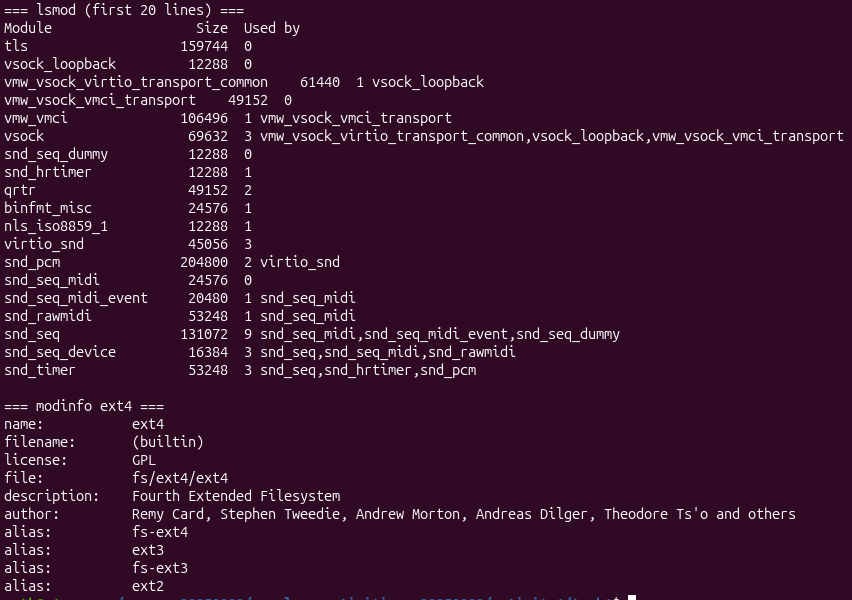

### OS Layers Diagram

### Questions

1. **What is `/proc`? Is it a real filesystem on disk?**

   `/proc` is a virtual filesystem. It doesn't exist on disk — the kernel generates its contents on the fly when files are read.

2. **Monolithic kernel vs. microkernel — which type does Linux use?**

   Linux uses a monolithic kernel. This is evident from `lsmod` showing loadable kernel modules, a key feature of monolithic kernels.

3. **What memory regions do you see in `/proc/self/maps`?**

   Regions include: code (text), data (initialized), bss (uninitialized), heap, stack, and shared libraries (libc, ld).

4. **Break down the kernel version string from `uname -a`.**

   [Your answer based on your `uname -a` output]

5. **How does `/proc` show that the OS is an intermediary between programs and hardware?**

   `/proc` exposes kernel data structures (CPU, memory, processes) to userspace, showing that programs must go through the kernel to access hardware information. The kernel controls what hardware details are exposed.

---

## Folder Structure
activity1/
├── README.md
├── screenshots/ # All screenshot images
├── warmup/ # Warm-up examples
│ ├── hello_syscall.c
│ ├── copyfilesyscall.c
│ └── ...
├── task1/ # File Creator & Reader
│ ├── file_creator_lib.c
│ ├── file_creator_sys.c
│ ├── file_reader_lib.c
│ ├── file_reader_sys.c
│ └── output.txt
├── task2/ # Directory Listing
│ ├── dir_list_lib.c
│ └── dir_list_sys.c
└── task3_strace/ # strace output files
├── strace_lib_task1.txt
├── strace_sys_task1.txt
├── strace_summary_lib.txt
└── strace_summary_sys.txt

---

## Reflection
In this activity, I learned that library functions like fopen() and printf() are convenient wrappers that hide the complexity of making direct system calls like open() and write(). Using strace, I could see that the library version makes many more system calls due to buffering and library initialization. The most surprising discovery was that printf() doesn't directly call write() every time — it buffers output and only makes one system call when the buffer is full or the program exits. I also learned that the /proc filesystem provides a window into the kernel, allowing user programs to access hardware and process information through virtual files. This activity helped me understand the fundamental difference between user-space library functions and kernel-level system calls.