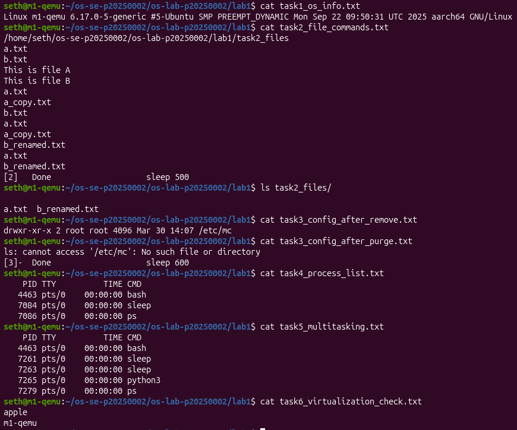

# OS Lab 1 Submission

- **Student Name:** [Dara Panhaseth]
- **Student ID:** p20250002

---

## Task 1: Operating System Identification

**Observations:**
The system is running Linux kernel version 6.17.0-5-generic on aarch64 (ARM64) architecture.

**Evidence:**
Linux m1-qemu 6.17.0-5-generic #5-Ubuntu SMP PREEMPT_DYNAMIC Mon Sep 22 09:50:31 UTC 2025 aarch64 GNU/Linux
---

## Task 2: Essential Linux File and Directory Commands

**Observations:**
- Created directory `task2_files` and files `a.txt` and `b.txt`
- Copied, renamed, and deleted files as instructed
- Final directory contains `a.txt` and `b_renamed.txt`

**Evidence:**
Final files in task2_files:
a.txt b_renamed.txt
---

## Task 3: Package Management Using APT

**Key Observation - Difference between `remove` and `purge`:**

**After `apt-get remove mc`:**
Configuration files remain:
drwxr-xr-x 2 root root 4096 Mar 30 14:07 /etc/mc
**After `apt-get purge mc`:**
Configuration files are deleted:
ls: cannot access '/etc/mc': No such file or directory
**Conclusion:** `remove` keeps configuration files; `purge` removes everything.

---

## Task 4: Programs vs Processes

**Observations:**
- `sleep 120` is a program stored on disk
- When executed with `&`, it becomes a process with a unique PID
- Program = static file; Process = running instance

**Evidence:**
PID TTY TIME CMD
4463 pts/0 00:00:00 bash
7084 pts/0 00:00:00 sleep
7086 pts/0 00:00:00 ps
---

## Task 5: Observing Multitasking

**Observations:**
- Installed `htop` and `tmux`
- Started three background processes: `sleep 500 &`, `sleep 600 &`, and `python3 -m http.server 8080 &`
- The OS runs all processes simultaneously, demonstrating multitasking

**Evidence:**
PID TTY TIME CMD
4463 pts/0 00:00:00 bash
7261 pts/0 00:00:00 sleep
7263 pts/0 00:00:00 sleep
7265 pts/0 00:00:00 python3
7279 pts/0 00:00:00 ps
---

## Task 6: Virtualization Detection

**Observations:**
The system is running in a virtualized environment using QEMU on Apple M1 hardware.

**Evidence:**
apple
m1-qemu
---

## Complete Lab Evidence

---

## Summary

| Task | Description | Status |
|——--|—————--|———-|
| 1 | OS and Kernel Identification | ✅ |

| 2 | Linux File Commands | ✅ |

| 3 | APT remove vs purge | ✅ |

| 4 | Programs vs Processes | ✅ |

| 5 | Multitasking | ✅ |

| 6 | Virtualization Detection | ✅ |
