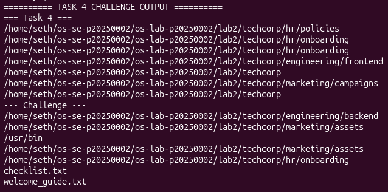
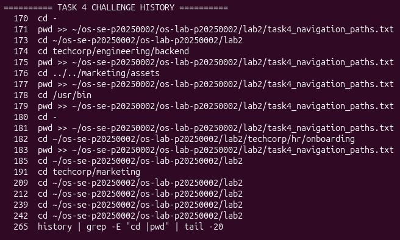
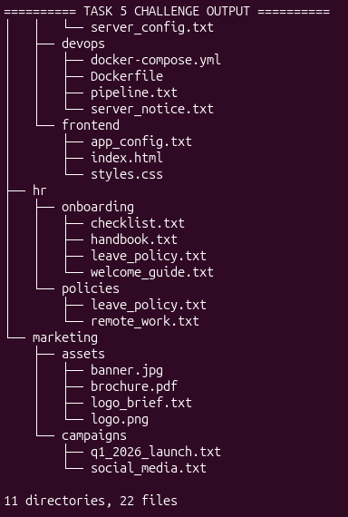
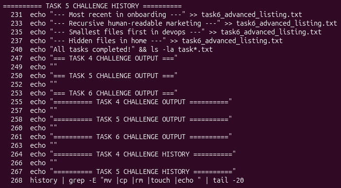
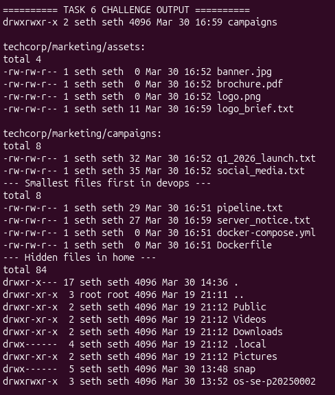
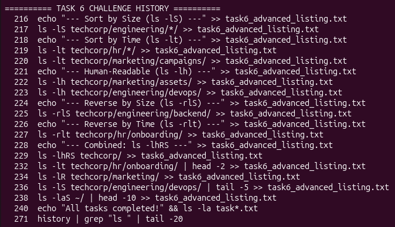
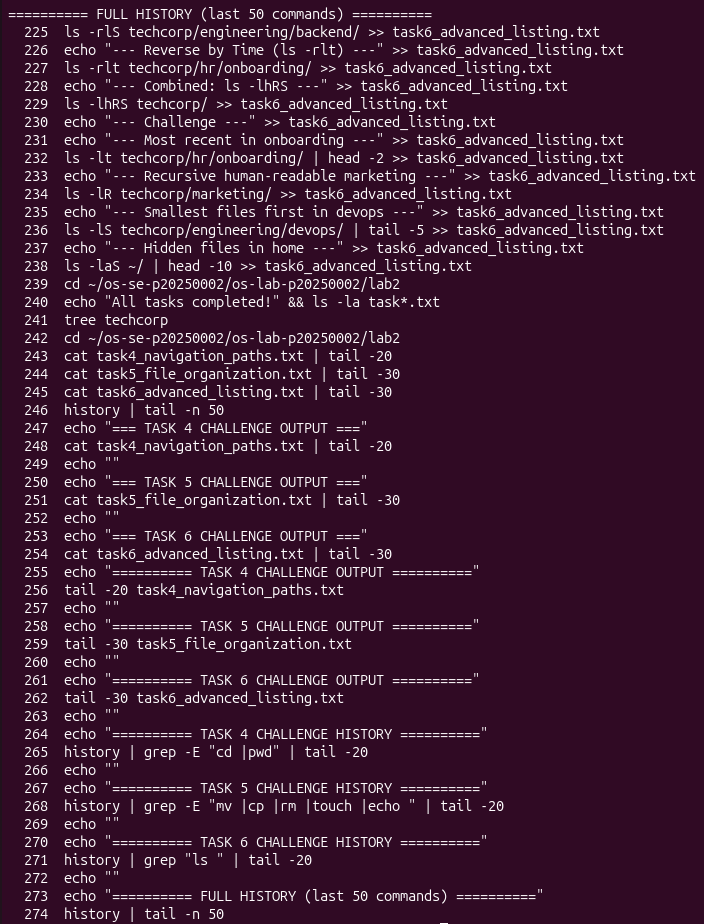

# OS Lab 2 Submission

- **Student Name:** [Dara Panhaseth]
- **Student ID:** p20250002

---

## Task Output Files

- ✅ task1_basic_navigation.txt
- ✅ task2_filesystem_exploration.txt
- ✅ task3_directory_structure.txt
- ✅ task4_navigation_paths.txt
- ✅ task5_file_organization.txt
- ✅ task6_advanced_listing.txt

---

## Screenshots

### Task 4 Challenge

### Task 5 Challenge

### Task 6 Challenge

### Full Command History

---

## Directory Structure
techcorp/
├── engineering/
│ ├── frontend/
│ ├── backend/
│ └── devops/
├── hr/
│ ├── policies/
│ └── onboarding/
└── marketing/
├── campaigns/
└── assets/

Total: 11 directories, 22 files